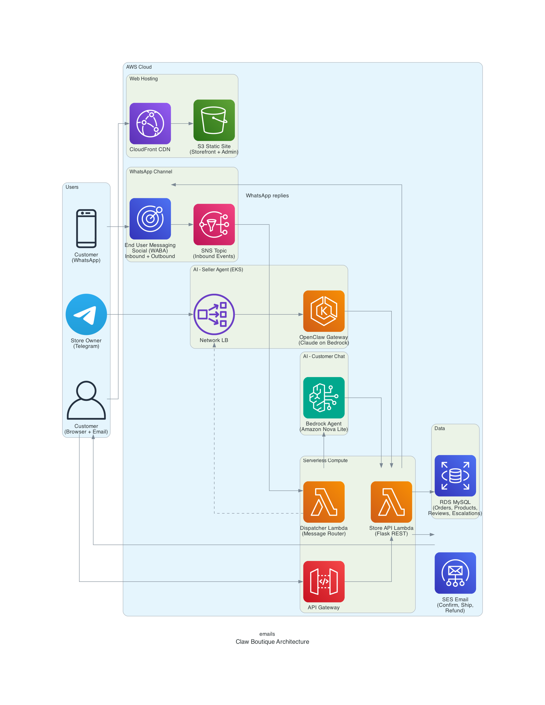
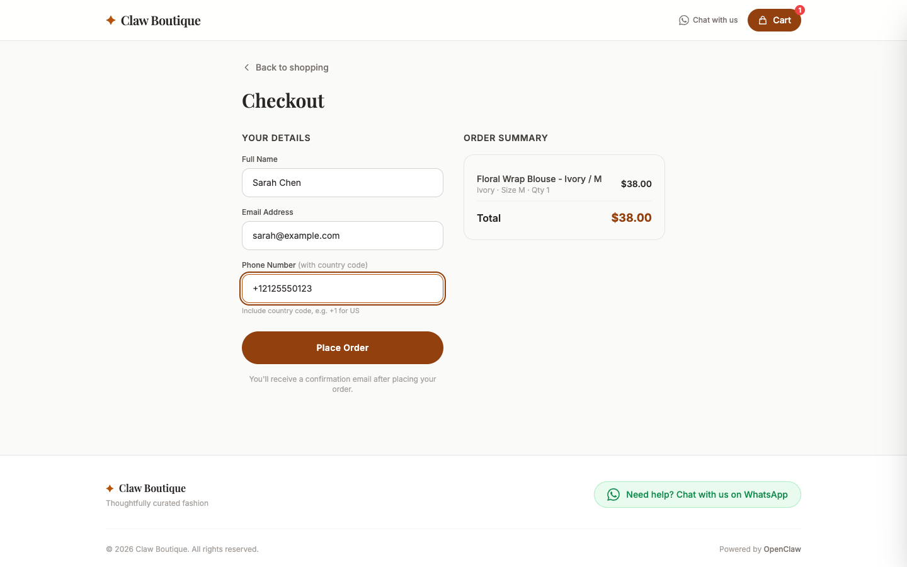
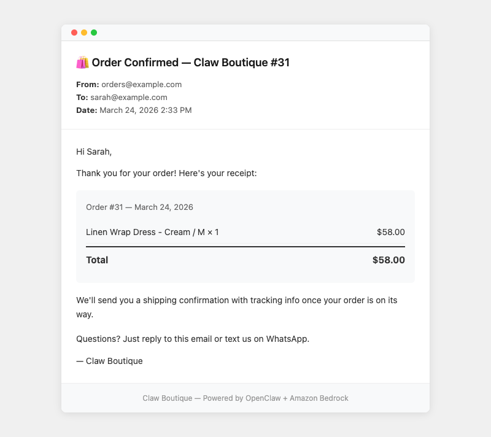
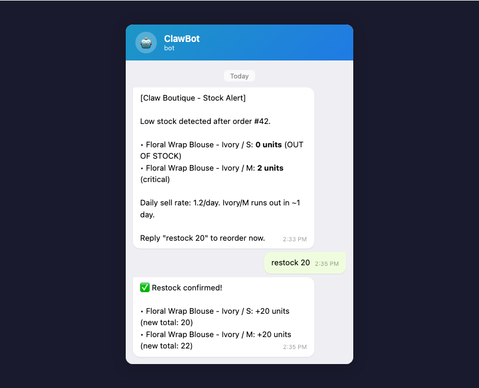
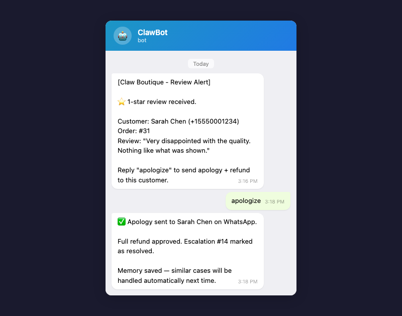
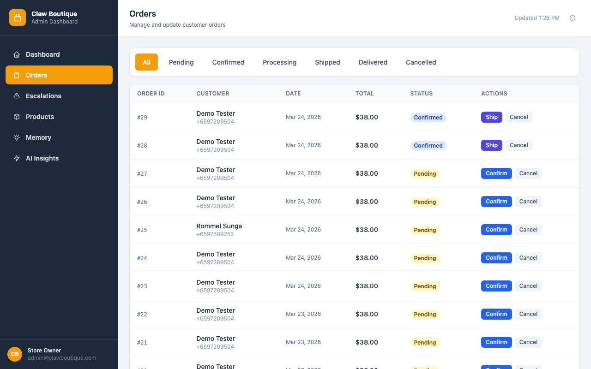

# Claw Boutique

AI-powered WhatsApp e-commerce bot built on AWS. Customers browse and order through a web storefront, then receive WhatsApp messages and emails for order confirmation, surveys, and refunds. The store owner manages everything through Telegram, where an AI agent (Claude on EKS) handles restock, refund, and order commands.



## How it works

Two AI models, two channels:

- **Customer channel (WhatsApp)** -- A Bedrock Agent (Nova Lite) handles real-time conversations. Customer messages arrive via End User Messaging Social, route through SNS to a Dispatcher Lambda, and get processed by the agent. Fast and cheap for high-volume tool-calling.
- **Seller channel (Telegram)** -- OpenClaw runs Claude on EKS. The store owner receives stock alerts, review escalations, and order notifications on Telegram. They reply with commands like "restock", "apologize", or "ship order 42", and ClawBot executes them.
- **Web storefront** -- CloudFront serves a static site from S3. Checkout calls the Store API through API Gateway.

All three channels share the same Store API Lambda and RDS MySQL database.

### Services used

| Service | Role |
|---------|------|
| End User Messaging Social | Managed WhatsApp Business integration |
| Telegram Bot API | Seller notification and command channel |
| SNS | Event bus for inbound WhatsApp messages |
| Lambda (Dispatcher) | Routes WhatsApp events to Bedrock Agent or Store API |
| Lambda (Store API) | Flask REST API for orders, products, reviews, escalations |
| Bedrock Agents (Nova Lite) | Real-time customer WhatsApp chat |
| EKS | Hosts OpenClaw gateway (Claude) for the seller Telegram channel |
| RDS MySQL | Products, customers, orders, reviews, escalations |
| SES | Order confirmation, shipping, and refund emails |
| CloudFront + S3 | Static web storefront and admin dashboard |
| API Gateway | REST endpoint for the Store API |
| NLB | Exposes OpenClaw on EKS to the Dispatcher Lambda |
| Secrets Manager | Database credentials |

---

## Demo walkthrough

A single order touches the web storefront, WhatsApp, email, Telegram, and the admin dashboard. Here is the full flow.

### Step 1: Place an order

Open the storefront, add an item to cart, fill in your name, email, and phone number, and click Place Order.




### Step 2: Receive order confirmation

Two things happen immediately:

- **WhatsApp** -- The customer gets a confirmation message with the order number, items, and total, followed by a feedback survey ("rate 1-5").
- **Email** -- A confirmation email arrives via SES with the same order details.




### Step 3: Low stock alert on Telegram

Every purchase triggers a stock check. If any item drops below threshold (out of stock, fewer than 5 units, or projected to run out within 7 days), the seller gets a Telegram alert with stock levels and sell rates.

The seller can reply `restock <product>` to add inventory. ClawBot runs the restock tool and confirms the new total.



### Step 4: Customer gives negative feedback

The customer replies "1" to the WhatsApp survey. The Store API creates an escalation record and sends the seller a Telegram review alert with the customer's name, phone, rating, and review text.



### Step 5: Seller sends refund via Telegram

The seller replies `apologize` on Telegram. ClawBot looks up the unresolved escalation, then:

1. Sends a WhatsApp apology message to the customer
2. Sends a refund confirmation email to the customer via SES
3. Marks the order as "refunded" in the database
4. Resolves the escalation

If there are multiple open escalations, ClawBot lists them and asks which one.

### Step 6: Check the admin dashboard

The seller opens the admin dashboard to see orders (now showing "refunded" status), escalation history, stock levels, and products.




---

## Other features

**Order via WhatsApp** -- Customers can browse and order by texting the WhatsApp business number directly. The Bedrock Agent handles the full conversation.


**Telegram seller commands** -- The store owner can manage the shop entirely from Telegram:

| Command | What it does |
|---------|-------------|
| `restock <product>` | Add 1 unit to inventory (or specify qty) |
| `apologize` | Send WhatsApp apology + refund email, resolve escalation |
| `confirm <order>` | Confirm a pending order |
| `cancel <order>` | Cancel an order |
| `ship <order>` | Mark order as shipped |
| `stock report` | Get current inventory levels |
| `orders` | List recent or pending orders |

**AI Insights** -- OpenClaw generates periodic business insights based on order patterns and customer feedback, visible on the admin dashboard.


---

## Project structure

```
claw-boutique/
  cdk/                    CDK stack (EKS, RDS, VPC, Lambda, SNS, SES, S3, CloudFront)
  docker/openclaw/        Dockerfile for OpenClaw container (built by CDK, pushed to ECR)
  lambda/
    dispatcher/           SNS event router (TypeScript)
    store-api/            Flask REST API (Python)
    db-initializer/       Custom resource Lambda for schema + seed data
  openclaw/
    openclaw.json         Agent config (model, tools, channels)
    tools/                Python tool scripts called by OpenClaw (restock, apologize, etc.)
  web/static/
    index.html            Storefront
    admin.html            Admin dashboard
    js/store.js           Storefront logic
    js/admin.js           Admin dashboard logic
  docs/                   Architecture diagram, mockups, screenshots
```

---

## Deployment

CDK deploys all AWS resources in one command, including the EKS cluster, RDS database, and OpenClaw container.

```bash
git clone <this-repo>
cd claw-boutique

cd cdk && npm install
npx cdk bootstrap
npx cdk deploy \
  -c telegramBotToken="<token>" \
  -c telegramSellerId="<id>" \
  -c whatsappPhoneNumberId="<id>" \
  -c whatsappWabaId="<id>"
```

CDK handles database initialization (schema + seed data), Docker image build, ECR push, and EKS deployment automatically.

After CDK finishes:

1. **WhatsApp** -- Link your WABA phone number to the SNS topic ARN in the EUM Social console
2. **Telegram** -- Send `/start` to the bot from the seller's Telegram account
3. **SES** -- Verify your sender email address for customer emails

---

## License

MIT
