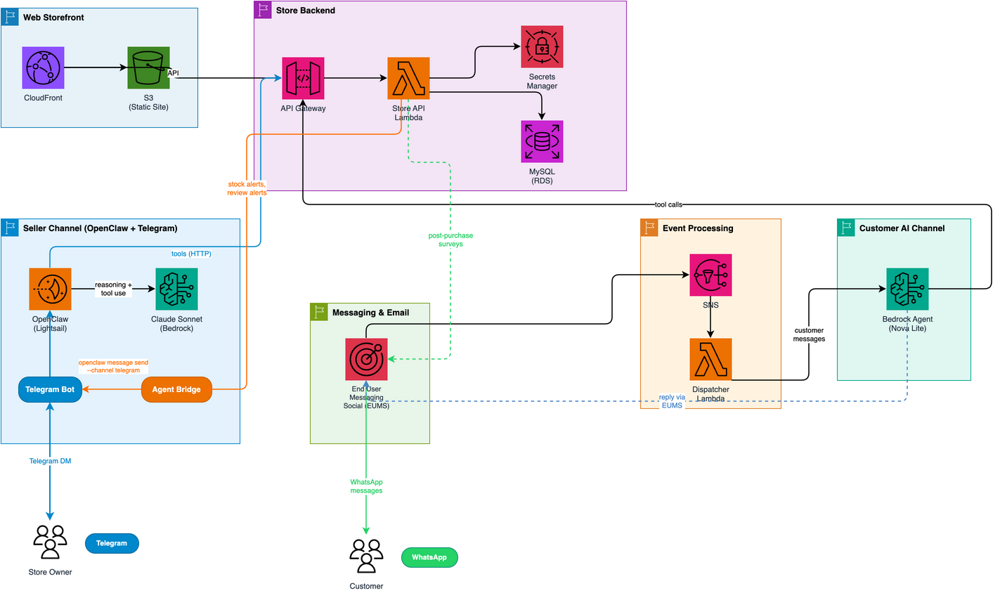
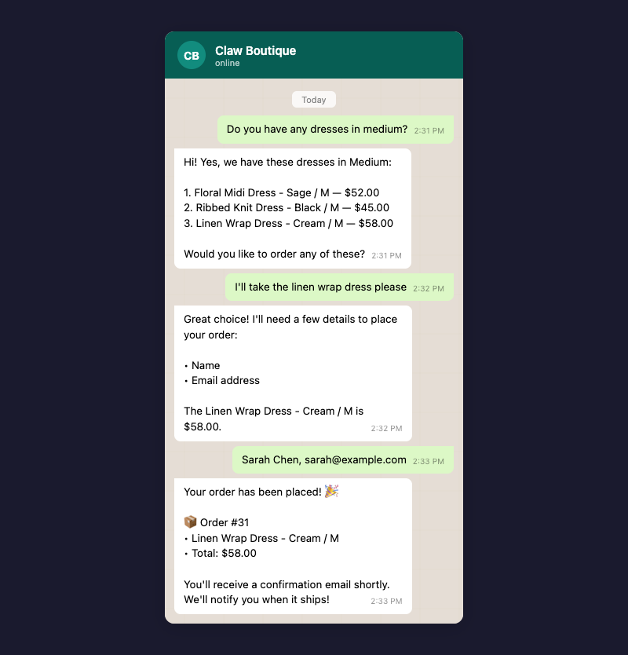
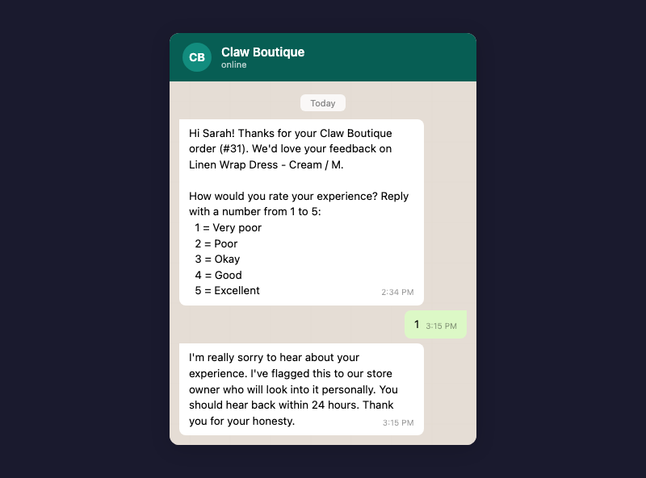
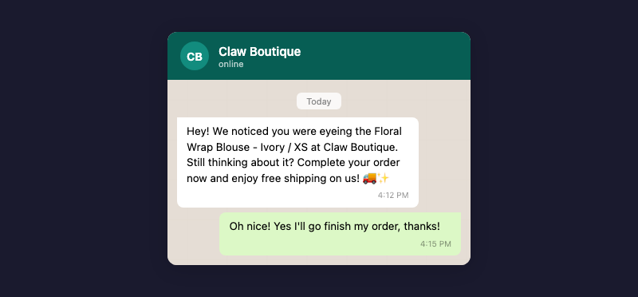
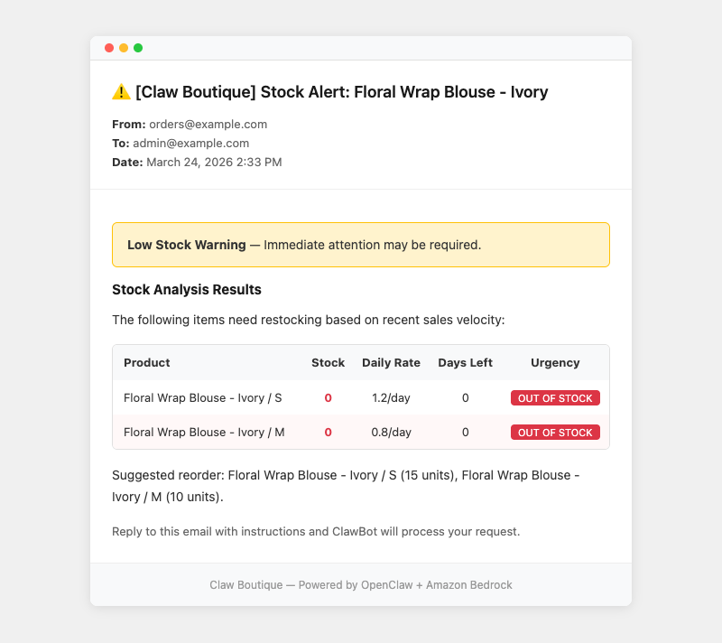
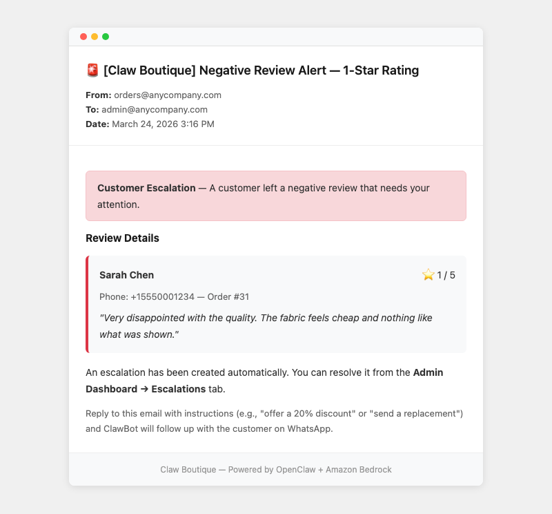
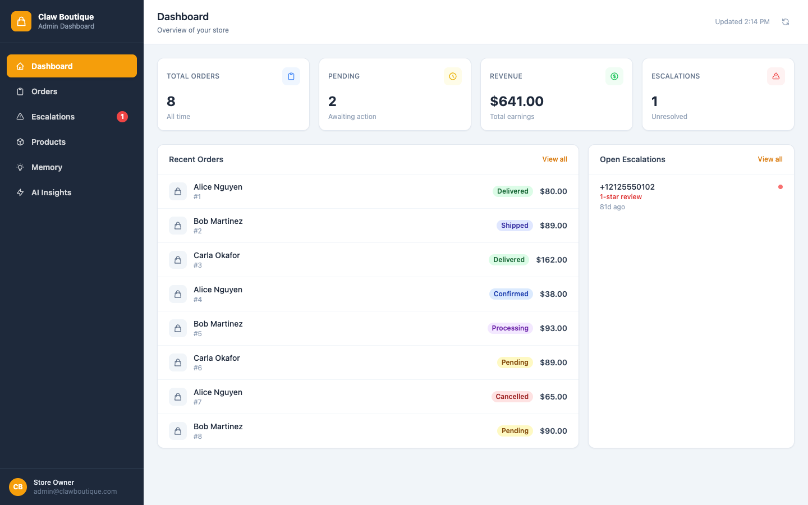
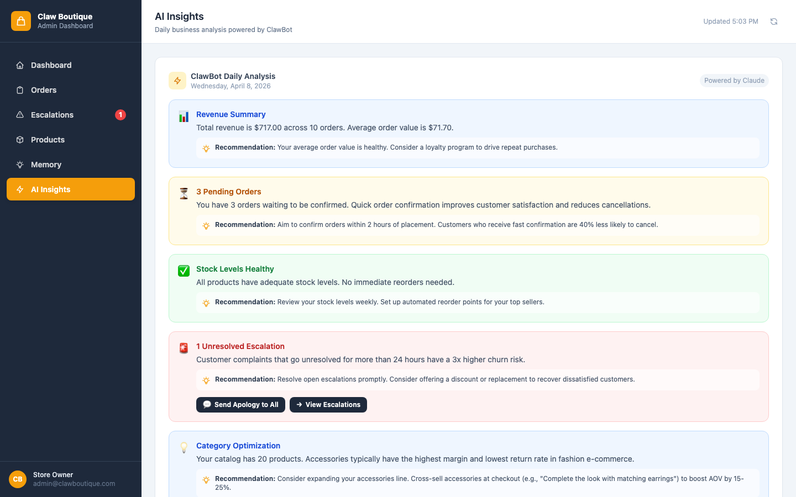

# Claw Boutique

AI-powered WhatsApp e-commerce bot built on AWS. Customers text a WhatsApp number to browse products, place orders, and get support. A Bedrock Agent (Nova Lite) handles conversations in real time. The store owner manages the shop through Telegram: stock alerts, review escalations, and restock commands all flow through a Telegram bot backed by OpenClaw on Lightsail, using Claude on Bedrock for reasoning.

**[See the demo guide](docs/demo-guide.md)** for a step-by-step walkthrough with screenshots.

---

## Architecture



**Customer-facing (fast, cheap):**

1. Customer sends a WhatsApp message to the business number
2. EUM Social receives it and publishes to SNS
3. A Lambda dispatcher parses the payload and invokes a Bedrock Agent (Nova Lite)
4. The agent calls tools (browse catalog, create order, check stock) against the Store API
5. The reply goes back to the customer via EUM Social
6. A copy of every message exchange is sent async to OpenClaw for memory and insights

**Seller channel (Telegram):**

The store owner interacts through a Telegram bot backed by OpenClaw on Lightsail. The Store API sends stock alerts, review alerts, and escalation notifications to the seller via the agent-bridge, which delivers them through Telegram. The owner replies in Telegram with commands ("restock", "apologize") and OpenClaw acts on them using Claude on Bedrock. OpenClaw also builds customer memory and generates the AI Insights dashboard.

**Web storefront:**

CloudFront serves the static site from S3, and the frontend calls the same Store API through API Gateway.

### Services used

| Service | What it does |
|---------|-------------|
| EUM Social | Managed WhatsApp Business integration (customer channel) |
| Telegram Bot | Seller notifications and command channel |
| SNS | Event bus for WhatsApp inbound events |
| Lambda (x2) | Dispatcher (routes messages) + Store API (Flask) |
| Bedrock Agents | Nova Lite for real-time customer WhatsApp conversations |
| Lightsail | Hosts OpenClaw + agent-bridge (seller channel, memory, insights) |
| Bedrock | Claude for OpenClaw reasoning and AI Insights generation |
| API Gateway | REST API for the Store API Lambda |
| MySQL | Products, customers, orders, reviews, carts |
| SES | Customer order confirmation emails |
| Secrets Manager | Database credentials |
| CloudFront + S3 | Static web storefront and admin dashboard |
| KMS | SNS topic encryption |

### Why these choices

**Bedrock Agent for customer WhatsApp.** The customer-facing chatbot handles structured tasks: catalog search, order placement, surveys. Nova Lite is fast and cheap for high-volume tool-calling. No persistent state needed.

**OpenClaw for the intelligence layer.** OpenClaw is an agentic orchestrator, not a chatbot. It handles admin email replies that require judgment, compacts interaction history into customer memory, and generates daily AI Insights. Lightsail gives it the persistent process it needs for long-running analysis.

**Two models, two jobs.** Nova Lite handles the commodity real-time work. Claude (via OpenClaw) handles strategic decisions where reasoning quality matters. This keeps costs low for customer traffic while preserving quality for admin actions.

**Telegram for the seller channel.** The store owner receives stock alerts, review escalations, and confirmation messages through a Telegram bot. Replies are processed by OpenClaw in real time. Telegram polling is more reliable than a WhatsApp linked device, which requires a QR-linked phone and breaks on gateway restarts.

**SES for customer emails.** Order confirmations and shipping notifications go to customers via SES. Transactional email is the right channel for receipts — it's archivable and doesn't require the customer to interact.

**Intentionally simple.** No ECS, no Fargate, no RDS Multi-AZ. Those make sense at scale but add complexity a solo store owner does not need.

---

## Features

### Order via WhatsApp

Customers browse the catalog, ask questions, and place orders through natural conversation. A Bedrock Agent (Nova Lite) handles the full flow: product search, detail collection, order creation, and confirmation.



### Post-purchase survey

After checkout, the customer gets a WhatsApp message asking to rate their experience (1-5). Ratings of 1 or 2 automatically create an escalation and send an alert email to the admin.



### Cart abandonment recovery

If a customer adds items to cart on the web storefront but does not check out, a WhatsApp message goes out offering free shipping.



### Stock alerts

Every purchase triggers a background stock analysis. The system calculates daily sell rates and projects days until stockout. When items are out of stock, below 5 units, or predicted to run out within 7 days, the store owner gets a Telegram alert.



### Review escalation

Negative reviews trigger a Telegram alert to the store owner with the customer's details, rating, and review text. The owner replies directly in Telegram with instructions (e.g., "apologize", "send refund"). OpenClaw processes the command and follows up with the customer on WhatsApp.



### Admin dashboard

Real-time stats, order management, escalation resolution, product catalog, interaction memory, and AI-generated business insights.





### Web storefront

Static site on CloudFront with product browsing, cart, and checkout. Auto-fills demo customer details for quick testing.


---

## Running the demo

**[Demo Guide with screenshots and mocked messages](docs/demo-guide.md)** - step-by-step walkthrough of every feature with inline screenshots of the storefront, admin dashboard, WhatsApp messages, and email alerts.

For a technical walkthrough with timing notes and troubleshooting, see `scripts/demo-script.md`.

---

## Project structure

```
claw-boutique/
  cdk/                    CDK stack (SNS, Lambda, SES, S3, CloudFront, API GW)
  lambda/
    dispatcher/           SNS event router (TypeScript)
    store-api/            Flask REST API (Python)
  openclaw/
    openclaw.json         Agent config (model, tools, channels)
    system-prompt.md      ClawBot persona and behavior rules
    tools/                Python tool scripts called by OpenClaw
  web/static/
    index.html            Storefront
    admin.html            Admin dashboard
    js/store.js           Storefront logic
    js/admin.js           Admin dashboard logic
  scripts/
    schema.sql            Database DDL
    seed_catalog.py       Sample product data
  tests/e2e/              Playwright E2E tests
  docs/                   Architecture diagram, screenshots, demo guide
```

---

## Deployment

CDK deploys all AWS resources (SNS, Lambda, SES, S3, CloudFront, API Gateway, Bedrock Agent, Secrets Manager, KMS) in one command. A few manual steps connect WhatsApp and the Lightsail agent.

```bash
git clone <this-repo>
cd claw-boutique
cp .env.example .env          # fill in all values

cd cdk && npm install
npx cdk bootstrap
npx cdk deploy                # save stack outputs
```

After CDK finishes:

1. **Database** - Run `scripts/schema.sql`, `scripts/schema_additions.sql`, and `scripts/seed_catalog.py` against your MySQL instance
2. **Lightsail** - Install OpenClaw, copy `openclaw/` config to `~/.openclaw/`, add the Telegram bot channel, start the agent bridge
3. **WhatsApp** - Link your WABA phone number to the SNS topic ARN in the EUM Social console
4. **Telegram** - Create a bot via BotFather, add it to OpenClaw with `openclaw channels add --channel telegram`, send `/start` to the bot from the seller's account
5. **SES** - Verify your sender email for customer order confirmations
6. **Validate** - `./scripts/validate-setup.sh`

---

## License

MIT
