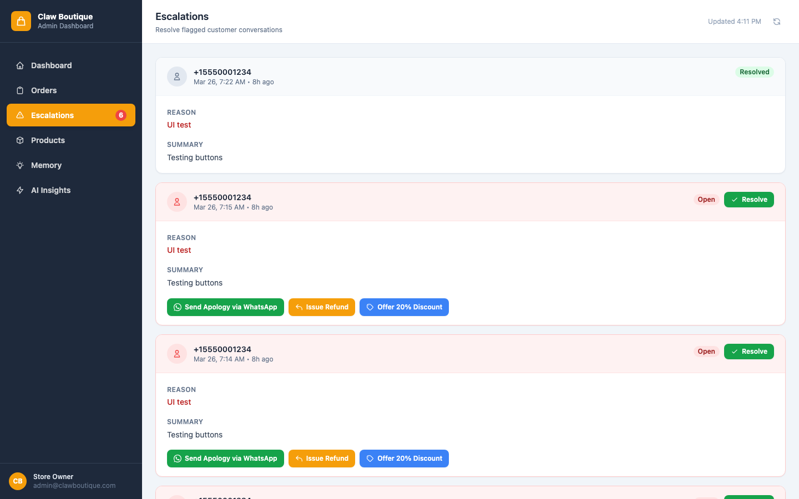

# Demo Guide

Step-by-step walkthrough of every feature in Claw Boutique. Open the storefront and admin dashboard side by side for the best experience.

- **Storefront:** https://d22y1hcx8ni0pf.cloudfront.net
- **Admin Dashboard:** https://d22y1hcx8ni0pf.cloudfront.net/admin.html
- **WhatsApp Business Number:** +1 249-209-7349

---

## 1. Browse the storefront

Open the storefront URL. The catalog loads with category tabs and product cards showing name, size, price, and stock.


Click **All**, **Tops**, **Dresses**, **Bottoms**, or **Accessories** to filter products. Each card has an **Add to Cart** button for in-stock items.

---

## 2. Add a product to cart

Click **Add to Cart** on any product. The cart badge in the header updates. Click the cart icon to open the slide-over panel and review items.

> A 2-minute abandonment timer starts when you add an item. If you don't check out in time, a WhatsApp recovery message goes to the customer (see Step 6).

---

## 3. Complete checkout

Click **Checkout**. Fill in customer details (or use the pre-filled demo values) and click **Place Order**.

Behind the scenes:
- The Store API creates the order in MySQL
- A stock check runs and sends a stock alert email to the admin (every purchase triggers this)
- A WhatsApp post-purchase survey is sent to the customer's phone number

---

## 4. WhatsApp post-purchase survey

After checkout, the customer receives a WhatsApp message asking for a 1-5 rating.


**What the customer sees:**

> Hi Demo Tester! Thanks for your Claw Boutique order (#37). We'd love your feedback on Floral Wrap Blouse - Ivory / XS.
>
> How would you rate your experience? Reply with a number from 1 to 5:
>   1 = Very poor
>   2 = Poor
>   3 = Okay
>   4 = Good
>   5 = Excellent

If the customer replies **1 or 2**, the system:
- Creates a review record in the database
- Creates an escalation visible on the admin dashboard
- Sends an escalation alert email to the admin
- Replies to the customer: "We're sorry to hear that. Our store owner has been notified and will follow up with you personally."

Ratings of 4-5 get a thank you reply. Rating 3 gets a "how can we improve" follow-up.

---

## 5. Stock alert email

Every purchase triggers a stock status email to the admin.


**What the admin receives:**

> **Subject:** [Claw Boutique] Stock Alert: 1 item(s) need attention
>
> **Floral Wrap Blouse** - Current stock: 4 units
> Daily sell rate: 1.2/day - Projected stockout: 3 days
> Suggested reorder: 10 units

The admin sees stock levels, sell rates, and projected days until stockout for every purchased item.

---

## 6. Cart abandonment recovery

Go back to the storefront and add a product to cart without checking out. After 2 minutes, the customer receives a WhatsApp recovery message.


**What the customer sees:**

> Hey! We noticed you were eyeing the Floral Wrap Blouse - Ivory / XS at Claw Boutique. Still thinking about it? We'd love to offer you free shipping if you complete your order in the next hour! Just reply here or visit our store.

---

## 7. Escalation alert email (from negative review)

If the customer gave a 1-star or 2-star rating in Step 4, the admin gets an escalation email.


**What the admin receives:**

> **Subject:** [Claw Boutique] Negative Review Alert: 1 star from Demo Tester
>
> Customer: Demo Tester (+6597209504)
> Rating: 1/5
> Review: WhatsApp survey reply: Very poor
>
> Please follow up with this customer as soon as possible.

---

## 8. Admin dashboard overview

Open the admin dashboard. The main page shows real-time stat cards: total orders, pending orders, revenue, and unresolved escalations.


All data comes from the live Store API and auto-refreshes every 30 seconds.

---

## 9. Manage orders

Click **Orders** in the sidebar. Use the status filter tabs (All, Pending, Confirmed, Shipped, Delivered, Cancelled) to find orders.


Click any order row to open the detail panel. From there:
- **Confirm** a pending order
- **Ship** a confirmed order (enter a tracking URL)
- **Mark Delivered** for shipped orders
- **Cancel** any open order

---

## 10. Handle escalations

Click **Escalations** in the sidebar. Open escalations show with a red border and action buttons.



Each open escalation has three action buttons:
- **Send Apology via WhatsApp** - composes and sends a personalized apology
- **Issue Refund** - processes a refund for the customer
- **Offer 20% Discount** - generates and sends a discount code via WhatsApp

Buttons show a spinner while processing, then switch to "Done" when complete. Click **Resolve** to close the escalation.

---

## 11. View products

Click **Products** in the sidebar. The full catalog shows with stock levels. Items below 5 units show a **Low** badge and a **Restock** button. Out-of-stock items show an **Out** badge in red.

Clicking **Restock** triggers a simulated restock order (button changes to "Done").

---

## 12. Customer memory

Click **Memory** in the sidebar. This shows saved interaction memories for each customer. Click **Add Memory** to log a new entry with phone number, type, summary, and tags.

OpenClaw automatically compacts interaction history into these memory entries over time. The Bedrock Agent can reference them for context in future conversations.

---

## 13. AI Insights

Click **AI Insights** in the sidebar. ClawBot generates a daily analysis from live store data.


Insight cards include:
- **Revenue Summary** - total revenue, order count, average order value
- **Pending Orders** - unconfirmed orders that need attention
- **Stock Alert** - out-of-stock and low items with a **Restock All Low Items** button
- **Escalations** - unresolved customer complaints with **Send Apology to All** and **View Escalations** buttons
- **Category Optimization** - suggestions for expanding product lines
- **WhatsApp Engagement** - recommendations for broadcast strategies

Each card has actionable buttons that trigger mock actions through OpenClaw.

---

## 14. WhatsApp browsing (Bedrock Agent)

Text the business WhatsApp number (+1 249-209-7349). The Bedrock Agent (Nova Lite) handles product browsing and support.


**Example conversation:**

> **Customer:** Hi, what dresses do you have in size S?
>
> **ClawBot:** Hey! Here are the dresses we have in size S:
> 1. Wrap Midi Dress - Sage Green - $68.00
> 2. Floral Wrap Blouse - Ivory - $42.00
> 3. Ribbed Bodycon Dress - Black - $55.00
>
> **Customer:** I'd like to buy the Wrap Midi Dress
>
> **ClawBot:** Great choice! To place your order, head to our storefront: https://d22y1hcx8ni0pf.cloudfront.net
> You can add the Wrap Midi Dress to your cart and check out there.

The bot can browse the catalog, look up order status, and create escalations. It directs customers to the storefront for purchases.

---

## Running E2E tests

The Playwright test suite covers all of the above automatically:

```bash
cd tests/e2e
npm install
npx playwright install chromium
npx playwright test
```

13 tests run across storefront (catalog, cart, checkout) and admin dashboard (stats, navigation, orders, filters, escalation actions, product restock, memory, insights, mobile nav).
